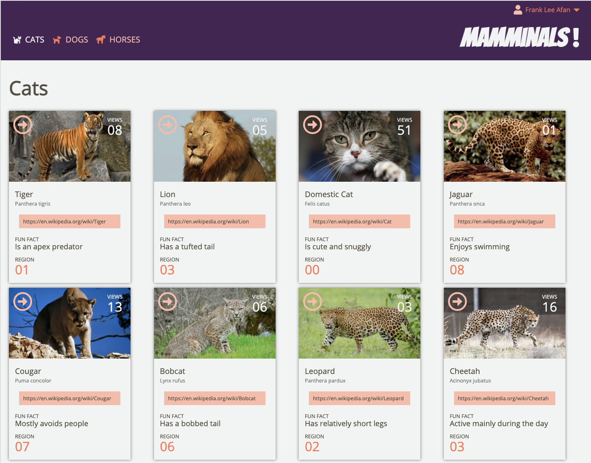
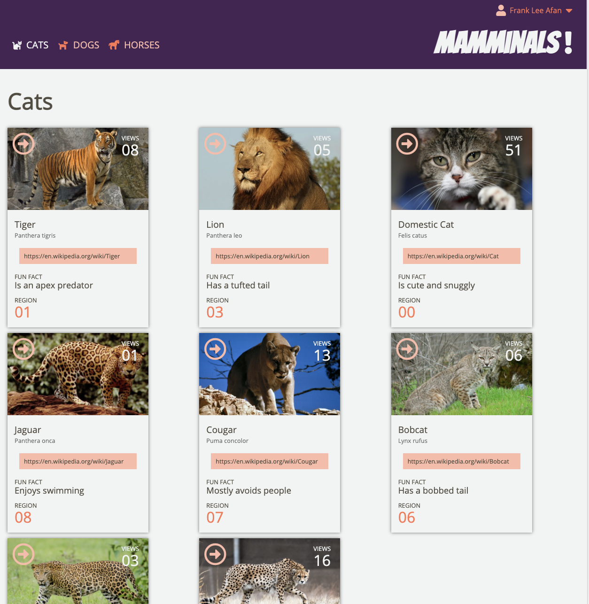
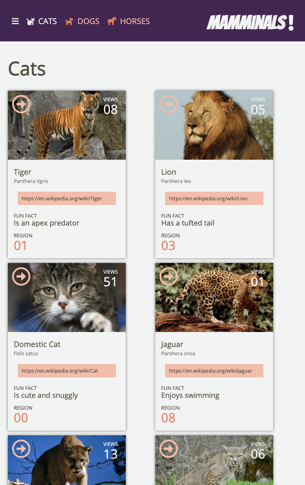
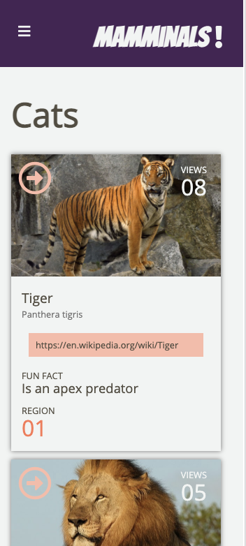

# Mamminals!
This [static page](https://knees4bees.github.io/mamminals) was developed as part of an [assignment](https://frontend.turing.io/projects/module-1/m1-static-comp) to match (with a generous amount of creative license) a provided comp. It works across three of the major browsers (Chrome, Firefox, and Safari) and across several screen sizes ranging from large desktop monitors down to mobile phones. The theme of the design has been changed to bring in some fun cat facts. 

### Provided comp

### Large design

### Medium design

### Small design

### Mobile design

